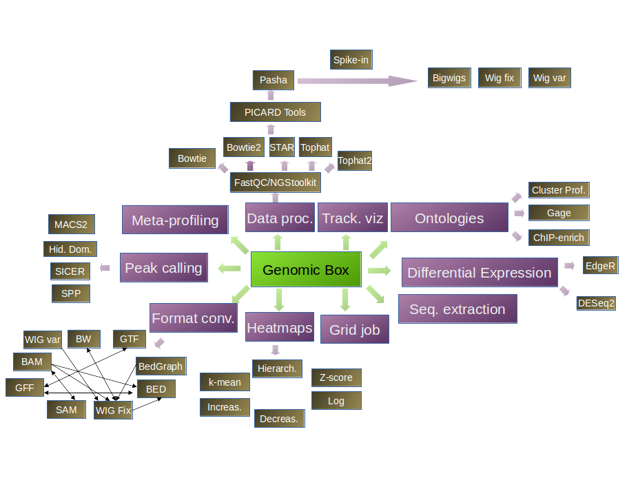

# GenomicBox GUI

## Introduction

**This java GUI is currently at an early stage of development**. 
I have worked mainly on the graphical interface. The next step is to connect 
it to the different pipelines that I am developing. This interface is 
developed under Ubuntu. I have not yet been into graphical uniformity display 
for MAC OS and Windows.

This interface is focusing on the treatment and analysis of ChIP-seq and 
RNA-seq data.

## Manifesto

Research in Genomics often needs standard analysis to enable a first 
investigation of the Data. This involves very often meta-gene profiling with 
ChIP-seq, **rough** peak detection, or differential expression on annotated 
genes with RNA-seq. Moreover, obtaining bigwigs to visualize the results of an 
experiment is an absolute priority for the biologist. Having to wait the 
availability of a bioinformatician to have *this first look* can be frustrating
 for the biologist, and be a burden for the bioinformatician being overloaded 
with requests.

Milicchio et al, Visual programming for next-generation sequencing data 
analytics, BioData Mining, 2016:

*Most of the current NGS software requires dedicated bioinformaticians with 
access to comprehensive computational infrastructure. Just a few years ago, 
there was a bottleneck between data generation and inference (analyzing and 
making sense of the data), but nowadays, access to these bioinformatics
resources is more common and affordable. The new bottleneck is the evolution of
 software inaccordance with technological advances and users needs.*

Several tools aim at providing solutions to accomplish standard 
bioinformatical analysis with graphical interfaces (EaSeq, QuickNGS, Galaxy, 
etc). However, I noticed that biologists who are not familiar with 
computational tools or newly switching to genome-wide analysis face conceptual 
challenges that they are not wiling to spend a large amount of time on to 
apprehend the different parameters proposed by the majority of tools. Moreover,
regarding the large success of IGV among biologists, I decided to provide the 
software in Java hoping to facilitate the adoption of GenomicBox by the 
community in the same manner. The interfaces aim at being *minimalistic* in an 
effort of simplification.

This interface aims at providing **an extremely minimalistic** number of 
parameters to the biologists while performing data processing and analysis in 
an enumerative approaches. In other words, the power of bioinformatic tools 
will be fully exploited by generating a maximum of results using different 
combinations of parameters. The advantage of such approach is that one can see 
the effects of the parameters in a visual way, enabling the user to focus on the
Biology. 
The interface is dynamic, hiding or displaying options according to the user 
selection, hence providing a guidance through the analysis. One of the future 
development will be to provide step-by-step guided interfaces for each kind of 
analysis. 

## Structure

This documentation will expand with the project. Below is a screenshot of the 
interface for DE analysis (the tables are completed automatically upon file 
selection) and a general overview of the different analysis provided by the 
GUI:

